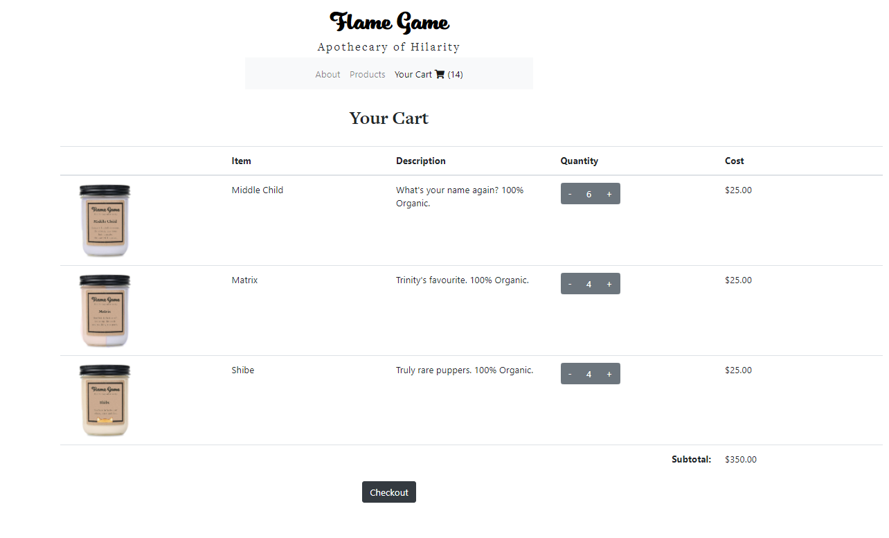
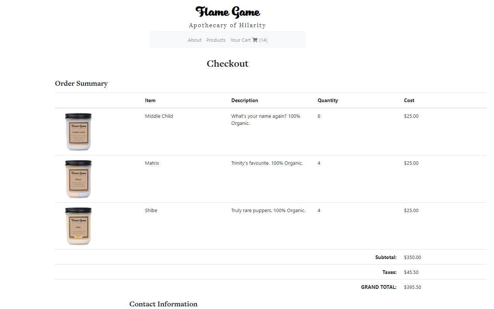
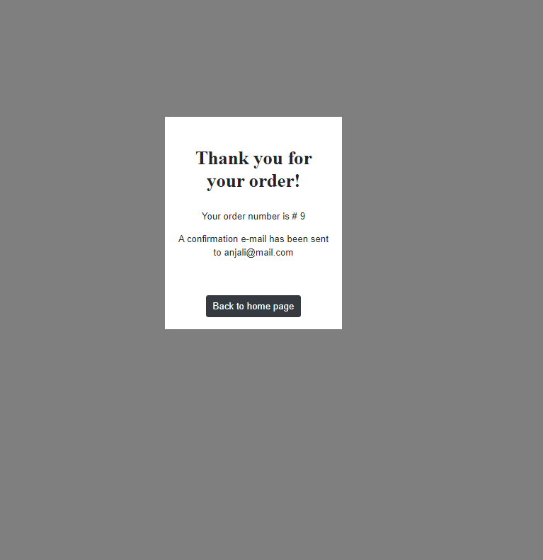

# Project-2-Flame-Game


## Table of Contents
- [Description](#description)
- [Technologies](#technologies)
- [Installation](#installation)
- [Usage](#usage)
- [Credits](#credits)
- [Deployment](#deployment)
- [License](#license)

## Description: 
 Welcome to our virtual store, Flame Game an Apothecary of Hilarity. In our virtual store you can choose from any number of fun candles for you and yours. Enjoy our fully functioning products page, cart and checkout. Flame Game is an ideal template for your online store!

## Technologies
- HTML
- CSS
- Bootstrap
- JavaScript
- NodeJs
- Express
- MySQL

## Installation:

Install express, js-image-zoom and mysql within package.json file using `npm install` command.
The dependencies are below:

* Use the [MySQL](https://www.npmjs.com/package/mysql) NPM package to connect to your MySQL database and perform queries.

* Use [express](https://www.npmjs.com/package/express) NPM package to that provides a robust set of features for web and mobile applications.

* Use [js-image-zoom](https://www.npmjs.com/package/js-image-zoom) JavaScript utility for desktop browsers for image zoom on mouse hover.

## Usage:

* Upon opening the site feel free to browse the products and add them to your cart.


* Upon selecting items feel free to adjust quantitites, and add or delete items from your cart.



* When you are ready to checkout, enter your information and you will receive a confirmation message.All items are adjusted in the database.





## Credits:

- Anjali Pant: Front end design and backend engineering
- Niki Fereidooni: Front end design and implementation
- Karim Kapadia: Back end framework and implementation
- Shaun Samoridny: Project Coordinator and repo management with some minor contributions to front and back end implementation

## Deployment

```bash
  $ git commit -m "{UPDATED MESSAGE}"
  $ git push origin master
  $ git push heroku master
```

This will deploy to [heroku](https://tranquil-temple-78360.herokuapp.com/) 


## Email Address:

For more questions about this project, feel free to contact us:

ssamoridny@gmail.com
nikifereidooni@gmail.com
pantanjali7@gmail.com
karimkapadia@gmail.com

## License:
    
MIT LICENSE

Copyright (c) [2020] [Shaun Samoridny, Niki Fereidooni, Anjali Pant, Karim Kapadia]

Permission is hereby granted, free of charge, to any person obtaining a copy
of this software and associated documentation files (the "Software"), to deal
in the Software without restriction, including without limitation the rights
to use, copy, modify, merge, publish, distribute, sublicense, and/or sell
copies of the Software, and to permit persons to whom the Software is
furnished to do so, subject to the following conditions:

The above copyright notice and this permission notice shall be included in all
copies or substantial portions of the Software.

THE SOFTWARE IS PROVIDED "AS IS", WITHOUT WARRANTY OF ANY KIND, EXPRESS OR
IMPLIED, INCLUDING BUT NOT LIMITED TO THE WARRANTIES OF MERCHANTABILITY,
FITNESS FOR A PARTICULAR PURPOSE AND NONINFRINGEMENT. IN NO EVENT SHALL THE
AUTHORS OR COPYRIGHT HOLDERS BE LIABLE FOR ANY CLAIM, DAMAGES OR OTHER
LIABILITY, WHETHER IN AN ACTION OF CONTRACT, TORT OR OTHERWISE, ARISING FROM,
OUT OF OR IN CONNECTION WITH THE SOFTWARE OR THE USE OR OTHER DEALINGS IN THE
SOFTWARE.
}